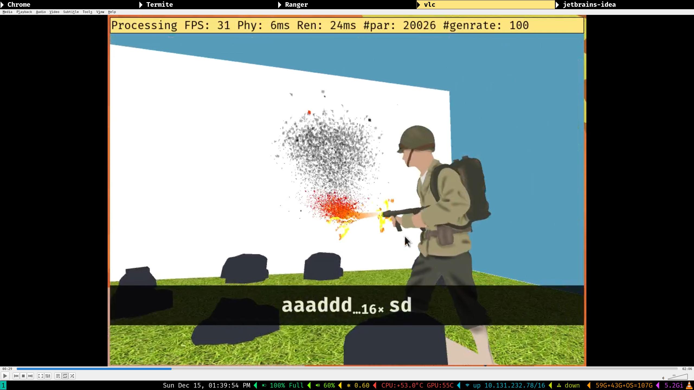
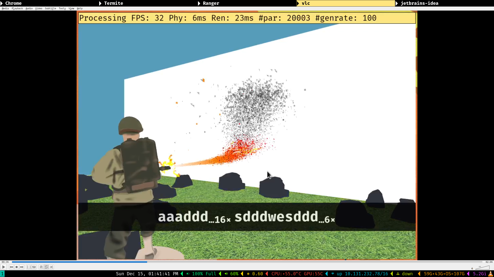
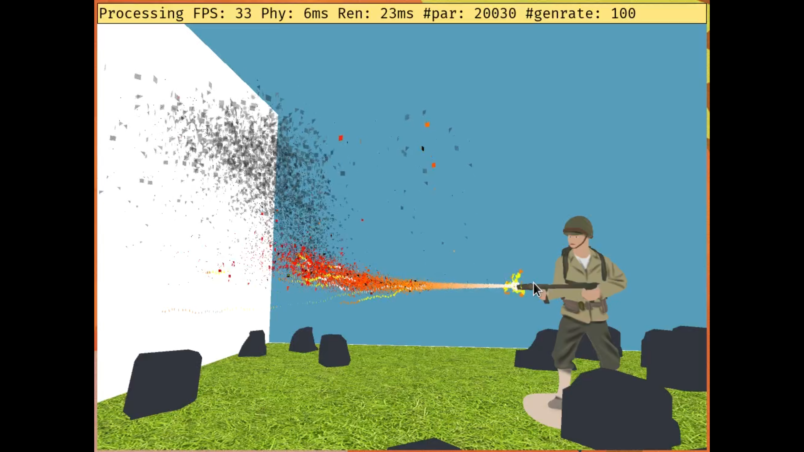
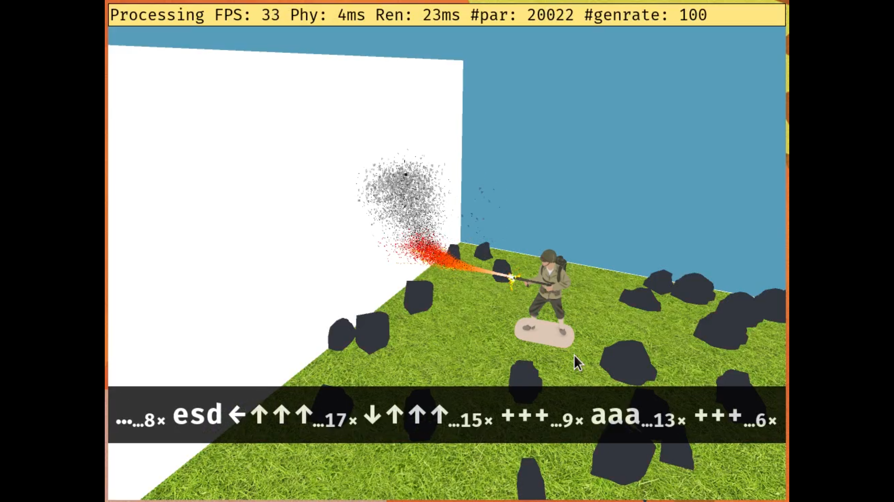
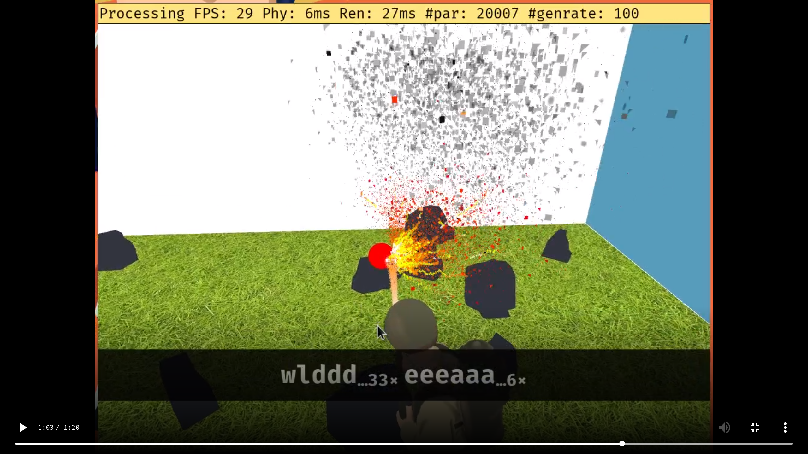
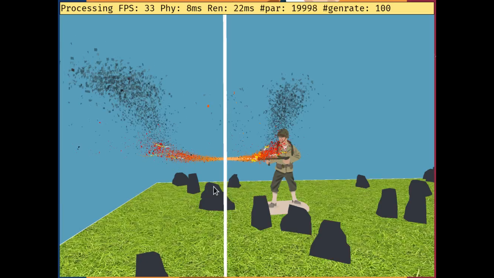
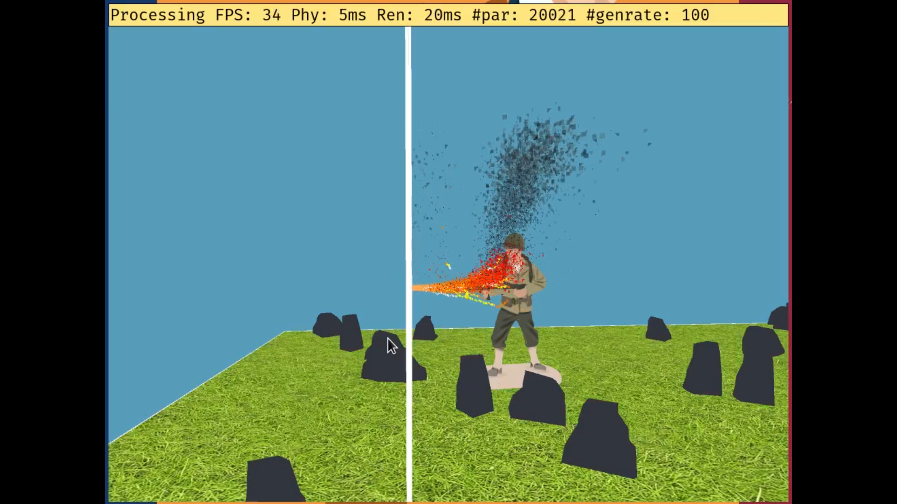

# particle-system-simulation-algorithms

## description
- Simple algorithms for simulating particle systems like fire, water, snow, sparks ...
- The goal is to create an interactive, real-time and good looking simulations.
- This project illustrates how simple mathematical equations can create good looking simulations and how important parameter tuning is.

## roadmap
- Problems solved until now are listed in demonstration section.

## code
- Code is written in Java, should work with JRE 8+.
    - `src/` contains all source code.
    - `jars/` contain all libraries bundled as jars.
        - `processing` is used as a rendering library.
        - `queasy cam` is used as a camera library.
        - `minim` is used as a sound library.
    - `data/` contains resources such as images, obj, mtl files.

### references
- [Reflecting a vector](https://math.stackexchange.com/questions/13261/how-to-get-a-reflection-vector)
- [Using ArrayList to hold multiple particle objects.](https://natureofcode.com/book/chapter-4-particle-systems/)
- [Minim player tutorial.](https://gist.github.com/shiffman/7603264)
- [Minim player debugging.](https://forum.processing.org/one/topic/why-does-minim-audioplayer-sound-choppy.html)
- [Minim player volume control.](https://discourse.processing.org/t/minim-setting-volume-of-an-audioplayer/3596/4)

## documentation
- For most of the code, the documentation is itself.

## usage
- Open a terminal at project root (the directory containing this file).
- Use `javac -cp "jars/*" -d build/ $(find -name "*.java")` to compile and put all output class files under `build/`.
- Use `java -cp "build/:jars/*" FireSimulation` to run the simulation.
- Controls
    - `w a s d` for basic camera movements.
    - `q e` for camera up and down movements.
    - `mouse` rotate camera.
    - `i o p` - toggle b/w no collision, discrete collision and continuous collision modes of wall respectively
    - `-, +` - increase/ decrease the flame generation rate
    - `UP, DOWN` - move the soldier forward or backward
    - `l` - toggle locking sphere to camera
- Tested on Ubuntu 18.04
    - If you use a distrubution that uses rolling release cycle (like Arch) you might have to install some older version of JRE and mesa (opensource intel openGL driver) that work with processing library.

## demonstration
- The title bar shows the state of the system at any instant.
- The videos demos are compiled into a [playlist](https://www.youtube.com/playlist?list=PLrz4CUP15JSJRikNSRDmKqxJxf19uM-NS).

### Single particle in a box under gravity
#### videos

### Flamethrower
#### videos

- Fire particles can go through different stages viz. JET, BALL, SMOKE, SPARK during their lifespan.
- Color change.
- Multiple shapes.
- Some accelerated particles in the jet reach far out.
- Some smoke comes out of the flame even near the nozzle.
- Smoke motion modelling using random displacements along with a general path.
- Gradual conversion to smoke.
- Spread of jet to fireball.
- Sparks at the nozzle and the end stage of the flame.
- Soldier moves @ `01:19`, smoke follows soldier @ `01:43`

#### images
| | |
| --- | --- |
|  |  |
|  |  |

### 3D user-controlled camera
#### videos

### Benchmarking
#### videos

- 20,000 particles simulated and rendered at over 30 FPS

### Translucent quads
#### videos

- Translucent spinning quads with color are used to add a bit of texture.

### Spark tails and interaction with objects
#### videos

- Tails on sparks.
- Sparks at the nozzle and the end stage of the flame.
- A ball is welded to camera (can be toggled by pressing 'l').
- Sparks generate when ball touches fire - 00:36 to end.
- Ball heats up when in flame and cools down when moved away from flame.

#### images

### Simulation driven audio
#### videos

- Couldn't record audio with screen recorders properly, so had to record on phone.
- For best demo use earphones.
- Audio presented in only in this video because of screen recorder issues. As such audio exists always.
- Volume changes with particle generation rate.
- Spike in volume when flame touches with ball @ `00:37` and `00:54`.

### Continuous collision detection
#### videos

- Demonstrated by switching b/w no-collision-detection, discrete-collision-detection and continuous-collision-detection modes interactively.
- @ `00:16` - no-collision-detection.
- @ `00:26` - discrete-collision-detection (checks if particle in wall or not, to reflect).
- @ `00:36` - continuous-collision-detection (checks if line segment joining position in last frame to current frame intersects will wall geometrically on each frame).

#### images
| | |
| --- | --- |
|  |  |
